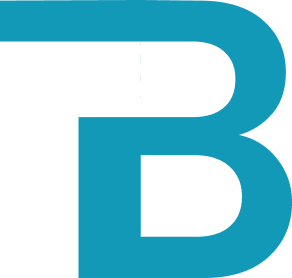

<p align="center">
  <a href="" rel="noopener">
 </a>
</p>

<h3 align="center">Budget Tracker</h3>

<div align="center">

[](https://github.com/tmadi626/BudgetTracker)
[](https://github.com/tmadi626/BudgetTracker/issues)
[](https://github.com/tmadi626/BudgetTracker/pulls)
[](/LICENSE)

</div>

---

## 🤔 Why Use it? 

It's about time indviduals start taking an active role in tracking their budget in a more proactive way by using Budget. 😛

## 📝 Table of Contents

- [About](#about)
- [Getting Started](#getting_started)
- [Built Using](#built_using)
- [Authors](#authors)
- [Acknowledgments](#acknowledgement)

## 🧐 About <a name = "about"></a>

The BudgetTracker software helps you keep track of your monthly budget so that you never have to lose track of your expenses again. BudgetTracker is currently for desktops and soll will be a cross platform app for iOS and Android. 

## 🏁 Getting Started <a name = "getting_started"></a>

These instructions will get you a copy of the project up and running on your local machine for development and testing purposes.

### Prerequisites

You will need JavaSDK, and JavaFX, and for an IDE Eclipse is recommended. 

### Installing

1. Clone this repo by typing the following command in a terminal window. 
```
git clone https://github.com/tmadi626/BudgetTracker.git
``` 

2. Cd into the directory that you just cloned. 
```
cd BudgetTracker
```
At this point, if you type 'ls', you should be able to see all the files in the repository listed. You should preferably do the next few steps in a terminal in VS code but it works if you continue to do it in your terminal as well. 

3. Run the software.


## ⛏️ Built Using <a name = "built_using"></a>

- Java
- JavaFX
- MySQL

## ✍️ Authors <a name = "authors"></a>

- [Taha Madi](https://github.com/tmadi626) 
- [Robert Stairs]()

## 🎉 Acknowledgements <a name = "acknowledgement"></a>

- Hat tip to Taha Madi for project idea and brand name.
